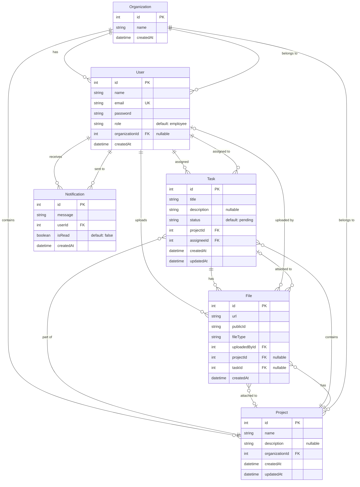

```mermaid
erDiagram
    Organization ||--o{ User : "has"
    Organization ||--o{ Project : "contains"
    
    User ||--o{ Task : "assigned"
    User ||--o{ File : "uploads"
    User ||--o{ Notification : "receives"
    User }o--|| Organization : "belongs to"
    
    Project ||--o{ Task : "contains"
    Project ||--o{ File : "has"
    Project }o--|| Organization : "belongs to"
    
    Task ||--o{ File : "has"
    Task }o--|| Project : "part of"
    Task }o--|| User : "assigned to"
    
    File }o--o| User : "uploaded by"
    File }o--o| Project : "attached to"
    File }o--o| Task : "attached to"
    
    Notification }o--|| User : "sent to"
    
    Organization {
        int id PK
        string name
        datetime createdAt
    }
    
    User {
        int id PK
        string name
        string email UK
        string password
        string role "default: employee"
        int organizationId FK "nullable"
        datetime createdAt
    }
    
    Project {
        int id PK
        string name
        string description "nullable"
        int organizationId FK
        datetime createdAt
        datetime updatedAt
    }
    
    Task {
        int id PK
        string title
        string description "nullable"
        string status "default: pending"
        int projectId FK
        int assigneeId FK
        datetime createdAt
        datetime updatedAt
    }
    
    File {
        int id PK
        string url
        string publicId
        string fileType
        int uploadedById FK
        int projectId FK "nullable"
        int taskId FK "nullable"
        datetime createdAt
    }
    
    Notification {
        int id PK
        string message
        int userId FK
        boolean isRead "default: false"
        datetime createdAt
    }
```
